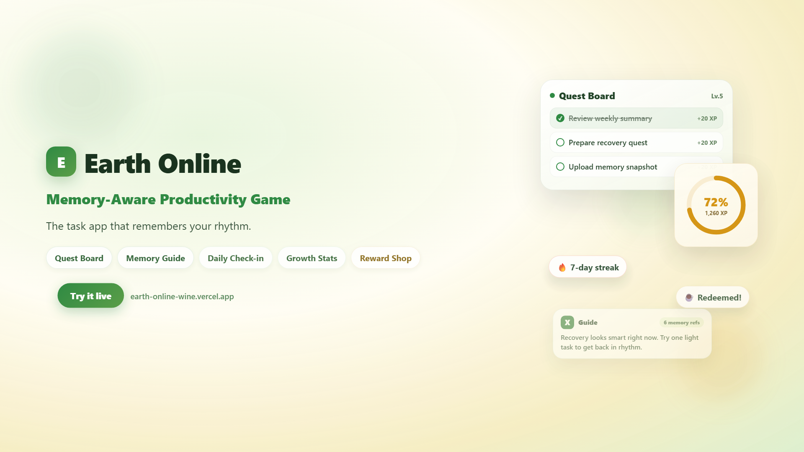

[English](./README.md) | [简体中文](./README.zh-CN.md)

# Earth Online

[](https://earth-online-wine.vercel.app)

<p align="center">
  <a href="https://earth-online-wine.vercel.app"><strong>Live Demo</strong></a> · <a href="./output/earth-online-intro.mp4"><strong>English Video</strong></a> · <a href="./output/earth-online-intro-zh.mp4"><strong>Chinese Video</strong></a> · <a href="https://github.com/xunyud/Earth-Online"><strong>GitHub</strong></a>
</p>

Earth Online is a memory-aware productivity game that turns everyday planning into an evolving quest log.

It is not just a task board. It remembers recent context, turns actions into usable memory, and guides the next step with a steadier sense of companionship.

> Think of it as a quest board, a memory layer, and an assistant that keeps the story of your recent life in view.

## Why

Most task tools are good at recording what should be done, but much weaker at helping people restart after momentum breaks.

Once a task is postponed, half-finished, or completed, the surrounding context often disappears with it. What was difficult? What had just been finished? What kind of rhythm was the user in? Traditional to-do products rarely keep that context alive in a way that meaningfully shapes the next recommendation.

Earth Online was built around a different idea: productivity tools should not only collect tasks. They should remember recent behavior, preserve short-term context, and help users resume with less friction. The goal is not to gamify work for its own sake, but to make progress feel visible, guidance feel grounded, and planning feel more like an evolving journey than a static checklist.

## Core Features

### 1. Quest Logging For Real Life

- Capture rough, real-world tasks on a quest board instead of forcing everything into polished planning upfront.
- Turn progress into visible feedback through XP, levels, achievements, rewards, and inventory systems.
- Keep the product anchored in actual behavior rather than abstract chat alone.

### 2. Context Recall

- Preserve recent quests, diary entries, behavior signals, and guide dialogue as usable context.
- Let users revisit what happened recently instead of treating each day as a blank page.
- Support recovery after interruptions through continuity rather than repeated re-entry.

### 3. Memory-Driven Guidance

- Read a memory digest before the assistant replies.
- Generate suggestions shaped by recent behavior and context instead of generic encouragement.
- Reuse the same memory layer across guide chat, daily events, portraits, and weekly summaries.

### 4. Companion-Like Feedback Loops

- Extend beyond reminders with daily events, nightly reflection, weekly summaries, and long-term portrait generation.
- Make the product feel like an ongoing loop of support, recall, and forward motion.
- Emphasize continuity, not one-off prompts.

### 5. Multi-Surface Interaction

- Use the Flutter client as the main home for quests, guidance, rewards, diary, and stats.
- Extend capture and guidance flows through Supabase Edge Functions and the lightweight backend.
- Support WeChat-based interaction so tasks and guidance can happen in more natural moments.

## Differentiators

### Not Just Another To-Do App

Earth Online does not stop at recording tasks. It turns actions, feedback, rewards, and recall into a continuous experience.

### Memory As Product Logic, Not Decoration

Memory is not an isolated feature page or a README slogan. It is part of the recommendation path that powers guide replies, daily event reasoning, portraits, and summaries.

### Guidance Shaped By Recent Behavior

The assistant is designed to read recent rhythm before it replies. That makes suggestions feel less template-driven and more grounded in what just happened.

### A More Companion-Like Productivity Loop

The product is trying to do more than remind. It aims to help users recover, continue, reflect, and restart with continuity.

### An Efficiency Game With Evolution

XP, levels, rewards, events, diary, and summaries make progress feel cumulative. The experience is closer to an evolving quest log than a static list manager.

## Tech Stack

- Flutter + Dart for the primary cross-platform client
- Supabase for database, auth, migrations, and Edge Functions
- TypeScript + Deno for serverless guide, memory, and task-processing functions
- Node.js + Express for the lightweight backend and webhook handling
- Redis for buffered message processing
- Remotion for the promo video pipeline

## Architecture / System Design

### Flutter Client

The `frontend/` app is the main interaction surface. It contains the quest board, guide experience, life diary, rewards, achievements, stats, and profile flows.

### Supabase Layer

The `supabase/` directory carries database migrations and Edge Functions such as `parse-quest`, `guide-bootstrap`, `guide-chat`, `guide-event-generate`, `guide-event-accept`, `sync-user-memory`, `weekly-summary`, and related background jobs. This layer handles most of the product logic around task parsing, memory-aware guidance, event generation, and summary workflows.

### Lightweight Backend

The `backend/` service provides an additional Node.js / Express entry point for webhook ingestion, debounced processing, Redis-backed buffering, and external model access where needed.

### Memory Flow

Earth Online treats recent activity as evidence:

1. Tasks, diary entries, behavior signals, and prior dialogue are collected.
2. Relevant context is packed into memory-oriented payloads or digests.
3. Guide replies, daily recommendations, portraits, and summaries consume that context before generating the next output.

This is the core system idea behind the product's "memory-aware" claim.

## Getting Started

### Prerequisites

- Flutter SDK
- Node.js and npm
- Supabase CLI

### Repository Layout

- `frontend/`: Flutter app
- `backend/`: lightweight Node.js / Express service
- `supabase/`: migrations and Edge Functions
- `promo-video/`: Remotion-based demo video project
- `output/`: rendered demo assets

### 1. Run the Flutter Client

```bash
cd frontend
flutter pub get
flutter run -d chrome
```

If you need desktop preview instead, use a supported Flutter desktop target such as `windows`.

### 2. Run the Lightweight Backend

Create a `.env` file in `backend/` with the variables referenced by the current codebase:

- `SUPABASE_URL`
- `SUPABASE_KEY`
- `REDIS_URL`
- `OPENAI_API_KEY`
- `OPENAI_BASE_URL`
- `PORT`

Then start the server:

```bash
cd backend
npm install
npm start
```

### 3. Work With Supabase

Start local Supabase services when needed:

```bash
supabase start
```

Push migrations:

```bash
./supabase db push
```

The current repo contains Edge Functions for parsing quests, guide chat, event generation, portrait generation, memory sync, and weekly summaries. Depending on which functions you run locally, the codebase references environment variables such as:

- `SUPABASE_URL`
- `SUPABASE_ANON_KEY`
- `SUPABASE_SERVICE_ROLE_KEY`
- `OPENAI_API_KEY` or `DEEPSEEK_API_KEY`
- `EVERMEMOS_API_URL`
- `EVERMEMOS_API_KEY`
- `EVERMEMOS_SYNC_TIMEOUT_MS`
- `POLLINATIONS_MODEL`
- `POLLINATIONS_API_KEY`
- `WECHAT_APP_ID`
- `WECHAT_APP_SECRET`

### 4. Render Promo Assets

```bash
cd promo-video
npm install
npm run render
npm run render:zh
npm run still
npm run still:zh
```

### 5. Optional Flutter Dart Defines

`frontend/lib/core/config/app_config.dart` also reads these compile-time values:

- `EVERMEMOS_API_KEY`
- `EVERMEMOS_BASE_URL`
- `EVERMEMOS_SENDER`

## Screenshots / Preview Assets

Current repository assets already available for preview:

- [English poster](./output/earth-online-poster.png)
- [Chinese poster](./output/earth-online-poster-zh.png)
- [English intro video](./output/earth-online-intro.mp4)
- [Chinese intro video](./output/earth-online-intro-zh.mp4)

Additional app screenshots can be expanded here as the live UI evolves.

## Recent Updates (v1.2.0 - 2026-03-27)

### New User Registration & Onboarding Fix
- Fixed OTP type mismatch that caused new user email signup to fail (signup uses `OtpType.signup`, login uses `OtpType.magiclink`)
- Fixed race condition where onboarding tutorial data check ran before controller initialization completed
- Coach marks overlay moved to full-screen layer above AppBar so highlight targets align correctly with their actual UI positions
- Highlight areas now pass through taps to underlying widgets, allowing users to interact with the app during the tutorial
- Added automatic skip-forward when a coach mark target is not found, preventing the overlay from locking the app
- Added "User Guide" entry in the app drawer for replaying the onboarding tutorial at any time

### Guide Assistant Improvements
- Chat input now supports Enter to send and Shift+Enter for newline (previously Enter did nothing in multiline mode)
- Fixed false "referenced N recent memories" display for new users by correcting local fallback paths that incorrectly used behavior signals as memory refs

### Stats Navigation
- Level bar area (level, XP, gold, streak, progress bar) in the home page top bar is now tappable and navigates to the Stats page

### Test Suite Maintenance
- Updated 4 stale test files to match current UI: login screen, guide panel dialog, i18n source checks

## Previous Updates (v1.1.0 - 2026-03-26)

### Growth Dashboard Redesign
- Rebuilt the stats page as an inspiring growth dashboard with warm cream / soft green / desaturated gold palette
- Hero XP card with animated counter and circular level progress ring
- Three-metric summary row (weekly completed, streak days, best day) replacing horizontal scroll cards
- Chart upgrades: card-wrapped containers, pill-shaped toggle, gradient bars, micro-stats row
- Quest mix horizontal bars replacing the old donut chart
- Motivational insight module and milestone badge highlights
- Staggered entrance animations (1200ms orchestrated across 8 sections)
- Responsive layout with mobile / tablet / desktop breakpoints

### Daily Check-In System
- Integrated `checkin_and_get_multiplier` RPC into the task completion flow
- Auto check-in on first daily task completion with orange banner feedback
- Streak counter displayed in the home page top bar (fire icon + days)
- Streak data flows through stats header, summary metrics, and milestone badges

### Make-Up Check-In (Retroactive Sign-In)
- New `makeup_checkin` RPC with atomic gold deduction, date validation, and streak recalculation
- 30-day streak calendar widget in the stats page with three cell states (checked / missed / today)
- Tap a missed day to spend 50 gold and fill the gap, with confirmation dialog and balance display
- Streak is fully recalculated after each make-up to maintain data consistency

## Design Philosophy

Earth Online starts from a simple belief: productivity tools should help people continue, not just record.

That requires memory. Without memory, every suggestion risks sounding generic, every restart feels heavier than it should, and every reflection becomes disconnected from what actually happened.

It also requires context. Tasks are not only checkboxes; they belong to a recent rhythm, a stretch of unfinished momentum, and a story that is still unfolding.

And it requires a different kind of assistant. A companion-like system should do more than notify. It should remember, interpret, and help the user move forward with steadier continuity.
