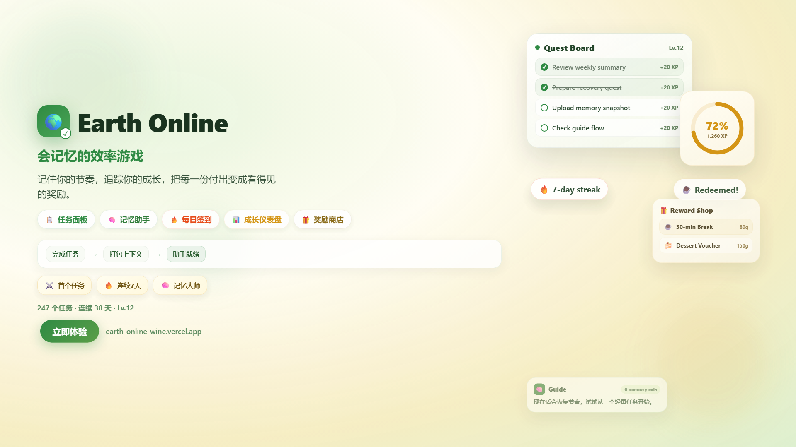

[English](./README.md) | [简体中文](./README.zh-CN.md)

# Earth Online

[](https://earth-online-wine.vercel.app)


<p align="center">
  <a href="https://earth-online-wine.vercel.app"><strong>在线体验</strong></a> · <a href="https://youtu.be/Dah5XAsEPNI"><strong>中文视频</strong></a> · <a href="https://youtu.be/-YLz6EwWYkw"><strong>英文视频</strong></a> · <a href="https://github.com/xunyud/Earth-Online"><strong>GitHub</strong></a>
</p>

Earth Online 是一款具备记忆感知能力的效率游戏，把日常计划转化成持续演化的任务日志。

它不只是任务面板，还会记住近期上下文，把行为沉淀为可用记忆，并以更有陪伴感的方式引导下一步。

> 你可以把它理解为：任务面板、记忆层，以及一个会持续看见你近期生活脉络的助手。

## 为什么做这个项目

大多数任务工具擅长记录“要做什么”，却不太擅长帮助用户在节奏中断之后重新启动。

一个任务一旦被推迟、做到一半，或已经完成，围绕它产生的上下文往往也随之消失了。刚刚完成了什么？最近卡在什么地方？这几天的节奏是推进、停滞，还是恢复中？传统待办产品通常不会以真正影响下一步建议的方式，把这些上下文保留下来。

Earth Online 想做的是另一种效率工具。它不只收集任务，还试图记住近期行为、保留短期上下文，并在用户需要继续的时候降低重新启动的摩擦。它的目标不是为了”游戏化”而游戏化，而是让进展更可见，让建议更有依据，让日常计划更像一段持续演化的旅程，而不是一张静态清单。

### EverMemOS 的作用

Earth Online 的”记忆感知”能力由 [EverMemOS](https://github.com/EverMind-AI/EverMemOS) 提供支持 — 一个面向 AI 应用的开源记忆操作系统。

在本项目中，EverMemOS 充当外部长期记忆层：

- **记忆同步**：用户完成任务后，应用会将已完成任务的结构化摘要通过 REST API 上传到 EverMemOS。每条记忆以用户维度隔离（`quest-log:{userId}`），确保个人上下文互不干扰。
- **记忆检索**：助手回复前，应用会从 EverMemOS 拉取该用户的近期记忆摘要，注入到助手的提示词上下文中，让建议基于用户实际做过的事情，而不是凭空猜测。
- **异步处理**：EverMemOS 以异步方式处理上传的记忆（返回 `request_id`），应用轮询处理状态后再拉取最新记忆 — 在不阻塞 UI 的前提下保证记忆层最终一致。
- **跨场景复用**：同一份记忆存储被助手对话、日常事件、用户画像和周报共同消费 — 让每个 AI 驱动的功能都能访问用户近期真实行为的上下文。

没有 EverMemOS，助手在跨会话之间就没有持久记忆。有了它，每一条建议、总结和事件都基于用户真实经历生成。

## 核心功能

### 1. 面向真实生活的 Quest 记录

- 把粗糙、真实的日常任务写入 Quest Board，而不是要求用户一开始就整理成完美计划。
- 用 XP、等级、成就、奖励和背包系统把推进感做成可见反馈。
- 让产品始终围绕真实行为，而不只是抽象对话。

### 2. 上下文回看

- 把近期任务、日记、行为信号和向导对话沉淀成可复用的上下文。
- 让用户可以回看最近发生了什么，而不是把每一天都当作空白页重来。
- 在中断之后通过连续性帮助恢复，而不是反复重新录入。

### 3. 记忆驱动的引导

- 助手回复前先读取记忆摘要。
- 建议会结合近期行为与上下文生成，而不是给出模板化鼓励。
- 同一层记忆能力会被复用于 Guide 对话、日常事件、画像和周报。

### 4. 陪伴式反馈循环

- 不只做提醒，还通过日常事件、夜间反思、周报和长期画像形成连续反馈。
- 让产品更像一个持续支持、回看和推进的循环。
- 强调连续体验，而不是一次性提示。

### 5. 多入口交互

- 以 Flutter 客户端作为 Quest、Guide、奖励、日记和统计的主体验入口。
- 通过 Supabase Edge Functions 与轻量后端延伸任务记录和引导链路。
- 支持微信场景下的任务记录与引导交互，让体验更贴近日常使用时刻。

## 项目亮点 / Differentiators

### 不只是另一个待办工具

Earth Online 不止于记录任务，而是把行动、反馈、奖励与回看组织成一条持续推进的体验链。

### 记忆是产品逻辑，不是装饰概念

“记忆”不是一个独立页面，也不是 README 里的口号。它直接参与 Guide 回复、日常事件理由、画像和总结生成。

### 建议会受到近期行为影响

这个助手的目标是在回复前先读取用户近期节奏，因此建议不会那么像模板，而更像是基于刚刚发生过的事情给出的下一步判断。

### 更像陪伴式效率循环

它试图做的不只是提醒用户“去做事”，而是帮助用户恢复、继续、回看，并带着连续性重新启动。

### 一款有演化感的效率游戏

XP、等级、奖励、事件、日记和周报共同让进展具备累积感。整体体验更接近一份持续演化的任务日志，而不是静态清单管理器。

## 技术栈

- Flutter + Dart：主客户端
- Supabase：数据库、认证、迁移和 Edge Functions
- TypeScript + Deno：服务端函数与记忆、引导、任务处理逻辑
- Node.js + Express：轻量后端与 webhook 处理
- [EverMemOS](https://github.com/EverMind-AI/EverMemOS)：AI 持久记忆层
- Redis：消息缓冲与延迟处理
- Remotion：演示视频制作管线

## 架构 / System Design

### Flutter Client

`frontend/` 是主要交互入口，承载 Quest Board、Guide、生活日记、奖励、成就、统计和个人资料等核心体验。

### Supabase Layer

`supabase/` 目录包含数据库迁移与 Edge Functions，例如 `parse-quest`、`guide-bootstrap`、`guide-chat`、`guide-event-generate`、`guide-event-accept`、`sync-user-memory`、`weekly-summary` 及相关后台任务。这个层负责大部分任务解析、记忆感知引导、事件生成与总结流程的产品逻辑。

### Lightweight Backend

`backend/` 提供额外的 Node.js / Express 入口，用于 webhook 接入、去抖处理、Redis 缓冲，以及需要时的外部模型连接补位。

### Memory Flow

Earth Online 把近期行为当作“证据”来使用：

1. 收集任务、日记、行为信号和历史对话。
2. 将相关上下文整理成面向记忆的摘要或 payload。
3. 让 Guide 回复、日常推荐、画像和总结在生成前先消费这些上下文。

这也是项目“记忆感知”定位最核心的系统逻辑。

## 本地运行 / Getting Started

### 前置依赖

- Flutter SDK
- Node.js 和 npm
- Supabase CLI

### 仓库结构

- `frontend/`：Flutter 应用
- `backend/`：轻量 Node.js / Express 服务
- `supabase/`：数据库迁移与 Edge Functions
- `promo-video/`：基于 Remotion 的演示视频项目

### 1. 运行 Flutter 客户端

```bash
cd frontend
flutter pub get
flutter run -d chrome
```

如果需要桌面预览，也可以切换到受支持的 Flutter 桌面目标，例如 `windows`。

### 2. 运行轻量后端

在 `backend/` 下创建 `.env` 文件，并配置当前代码实际读取到的变量：

- `SUPABASE_URL`
- `SUPABASE_KEY`
- `REDIS_URL`
- `OPENAI_API_KEY`
- `OPENAI_BASE_URL`
- `PORT`

然后启动服务：

```bash
cd backend
npm install
npm start
```

### 3. 使用 Supabase

需要本地 Supabase 环境时，可以先启动服务：

```bash
supabase start
```

推送迁移：

```bash
./supabase db push
```

当前仓库中的 Edge Functions 涵盖任务解析、Guide 对话、事件生成、画像生成、记忆同步和周报流程。根据你本地要运行的函数不同，代码中涉及的环境变量包括：

- `SUPABASE_URL`
- `SUPABASE_ANON_KEY`
- `SUPABASE_SERVICE_ROLE_KEY`
- `OPENAI_API_KEY` 或 `DEEPSEEK_API_KEY`
- `EVERMEMOS_API_URL`
- `EVERMEMOS_API_KEY`
- `EVERMEMOS_SYNC_TIMEOUT_MS`
- `POLLINATIONS_MODEL`
- `POLLINATIONS_API_KEY`
- `WECHAT_APP_ID`
- `WECHAT_APP_SECRET`

### 4. 渲染演示资源

```bash
cd promo-video
npm install
npm run render
npm run render:zh
npm run still
npm run still:zh
```

### 5. 可选的 Flutter Dart Define

`frontend/lib/core/config/app_config.dart` 还会读取以下编译期变量：

- `EVERMEMOS_API_KEY`
- `EVERMEMOS_BASE_URL`
- `EVERMEMOS_SENDER`

## 界面预览 / Preview Assets

当前可直接访问的预览入口：

- [英文海报](./output/earth-online-poster.png)
- [中文海报](./output/earth-online-poster-zh.png)
- [在线体验](https://earth-online-wine.vercel.app)
- [英文介绍视频](https://youtu.be/-YLz6EwWYkw)
- [中文介绍视频](https://youtu.be/Dah5XAsEPNI)

目前仅保留海报图片用于 README 预览，其余渲染生成的视频输出物不纳入版本控制，如有需要可在 `promo-video/` 中重新生成。

## 最近更新 (v1.2.0 - 2026-03-27)

### 新用户注册与新手引导修复
- 修复邮箱注册 OTP 类型不匹配导致新用户无法完成注册的问题（注册使用 `OtpType.signup`，登录使用 `OtpType.magiclink`）
- 修复新手引导判断条件在数据加载完成前就执行的竞态问题
- Coach Marks 遮罩移至 Scaffold 外层全屏覆盖，高亮位置不再因 AppBar 偏移而错位
- 高亮区域支持点击穿透，引导过程中可正常操作底层 UI（如输入任务）
- 目标找不到时自动跳到下一步，防止遮罩锁死界面
- 侧边栏新增"使用说明"入口，可随时重播功能引导

### 助手聊天体验优化
- 聊天输入框支持 Enter 发送、Shift+Enter 换行（之前多行模式下回车无法发送）
- 修复新用户没有记忆时仍显示"参考了 X 段近期记忆"的问题（本地 fallback 路径错误地将行为信号当作记忆引用）

### 数据统计跳转
- 首页顶栏等级/XP/金币/经验条区域支持点击跳转到数据统计页

### 测试维护
- 更新 4 个过期测试文件以匹配当前 UI：登录页、助手面板、国际化源码检查

## 历史更新 (v1.1.0 - 2026-03-26)

### 成长仪表盘重设计
- 全面重构统计页面，升级为暖奶油色 / 柔绿 / 低饱和金配色的成长仪表盘
- 英雄 XP 卡片：动画计数器 + 环形等级进度 (CustomPaint)
- 三卡横排摘要（本周完成 / 连续天数 / 最佳一天）替代旧横滑卡片
- 图表升级：卡片容器包裹、Pill 形切换、渐变柱形图、微统计行
- 任务构成横向进度条替代旧环形图
- 新增成长感言模块和里程碑徽章区域
- 8 区域交错入场动画（1200ms 编排）
- 响应式布局（移动端 / 平板 / 桌面端断点适配）

### 每日签到系统
- 接入 `checkin_and_get_multiplier` RPC 到任务完成流程
- 每日首次完成任务时自动签到，弹出橙色 banner 反馈
- 首页顶栏新增连续天数火焰 chip
- 连续天数贯穿仪表盘 Header、摘要卡片、里程碑徽章

### 补签功能
- 新建 `makeup_checkin` RPC：原子扣金币 + 日期校验 + 连续天数重算
- 数据统计页内嵌 30 天签到日历，三种格子状态（已签 / 漏签 / 今天）
- 点击漏签日花费 50 金币补签，含确认对话框和余额显示
- 补签后完整重算连续天数，确保数据一致性

## 项目理念 / Design Philosophy

Earth Online 的出发点很简单：效率工具不该只会记录，还应该帮助人继续前进。

这要求它具备记忆能力。没有记忆，建议很容易变得泛化，重新启动会更费力，回顾也会和真实发生过的事情脱节。

这也要求它尊重上下文。任务不只是一个复选框，它属于某段近期节奏、某个尚未完成的推进过程，以及一段还在继续展开的生活叙事。

同时，它也需要一种不同的助手形态。一个有陪伴感的系统不该只负责提醒，而应该能记住、理解，并帮助用户更平稳地继续往前走。
