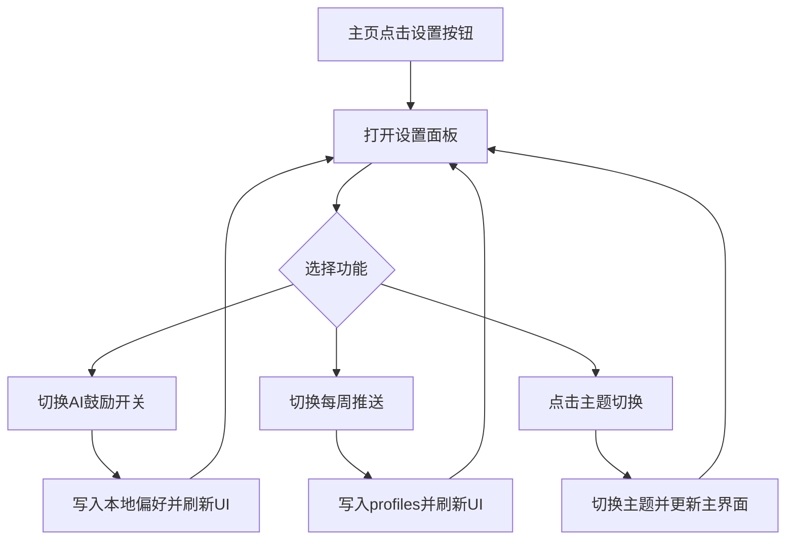

# 主页按钮重组方案（设置面板整合）

## 1. 目标
- 降低主页面顶部按钮密度，提升核心操作可见性。
- 将低频配置功能统一迁移到设置面板。
- 保留高频业务入口，避免破坏既有任务流。

## 2. 按钮审计

### 2.1 现状总数（主页面 AppBar）
- 共 9 个直接操作入口（不含同步状态指示器）。

### 2.2 分类结果
- 核心操作
  - 回收站
  - 全部移入回收站
- 辅助功能
  - 商店
  - 背包
  - 绑定
  - 生活日记
- 配置选项（低频）
  - AI 鼓励开关
  - 主题切换
  - 展开/收起全部
  - 每周推送开关

## 3. 迁移与保留清单

### 3.1 迁移到设置面板
- AI 鼓励语写入任务备注（原独立入口）
- 每周自动推送开关（原独立入口）
- 主题切换（原独立入口）

### 3.2 主页面保留
- 商店、背包、绑定、生活日记
- 统计、成就
- 展开/收起全部任务
- 全部移入回收站、回收站
- 设置入口（统一新增）

## 4. 设置面板结构设计
- 面板类型：BottomSheet
- 区块结构
  - 标题区：设置
  - 左侧：列表式设置导航（AI 鼓励 / 微信推送 / 主题外观）
  - 中间：所选设置项详情内容
  - 开关区（详情中）
    - AI 鼓励语写入任务备注
    - 每周自动推送到微信（绑定状态联动可用性）
  - 操作区（详情中）
    - 主题切换（扩展主题引导商城解锁）

## 5. 交互流程图

## 6. 验收点
- 设置按钮可打开统一面板。
- 统一面板为页面正中悬浮，左侧列表 + 中间详情。
- AI 鼓励开关可点击、可持久化、刷新后状态一致。
- 每周推送开关联动绑定状态。
- 主题切换从面板触发可即时生效。
- 展开/收起按钮保留在主页且可即时生效。
- 主页面按钮数量下降且核心入口保持可达。

## 7. 技术评估结论
- AI 鼓励功能判定为核心需求，不执行删除策略。
- 处理策略为“修复并整合”：修复开关持久化链路验证、合并入口到统一设置面板。
- 删除方案（按钮组件/事件/状态管理）仅作为降级预案，不在本次实施范围启用。
